# The Instruction file of my branch refactor/advanced-AI-model-replace
## by member Boyu Huang
### (Chinese-English bilingual version)

## 1.Executive Summary 摘要
Based on v1 which embeded a basic linear regression model, I embeded a DNN (Deep Neural Networks) model in the "trimming" station of the Anylogic model "Solar Panel Production Line" to fulfil better effect to predict trimming time of Solar Panel Production, and record initial testing data including advanced trimming time predicted by the new model and former trimming time predicted by the old linear regression model.
在嵌入了基本的线性回归模型的v1版本基础上，我在AnyLogic模型“太阳能电池板生产线(Solar Panel Production Line)”的“裁切”工位嵌入了一个深度神经网络（DNN）模型，以实现更好的太阳能电池板生产裁切时间预测效果，并记录初始测试数据，其中包括新模型预测的提前裁切时间以及旧线性回归模型预测的先前裁切时间。

## 2.Background 背景
In the initial Anylogic model (creator: Anylogic official), their is a station named as **Trimming** which controls the process of the edge trimming or cleaning steps after the battery panel are cut, and its process time is a double parameter named as "trimmingTime", and its value is locked at 60. \
**Drawback:** Fixed time fails to reflect the dynamic nature of a real factory. In actual production, machine speed often fluctuates based on the operator's pace, material properties, or upstream congestion.
在最初的Anylogic模型（创建者：Anylogic官方）中，有一个名为“trimming”的工位，它控制着电池板切割后的修边或清理工序，其时间由一个名为“trimmingTime”double类型参数表示，其值固定为60。
**缺点：**固定时间无法反映真实工厂的动态特性。在实际生产中，机器速度通常会根据操作人员的工作节奏、材料特性或上游拥堵情况而波动。

To introduce adaptability, a linear regression model was previously embedded using the formula: Time = Base - (Queue * 1.5) - (Material * 18). This allowed the station to "speed up" when the queue was long.
**Drawback:**The linear model lacks "boundary awareness." Since it is a simple straight-line equation, it continues to decrease indefinitely as input values increase. Under extreme conditions—such as a queue of 15 panels and high-speed material(Actually the biggest queue length isn't usually larger than 12) —the model predicts a **negative** processing time. Additionally, it assumes the impacts of queueSize and evaType are completely independent and additive, ignoring potential complex interactions between material properties and operator stress.
为了引入自适应能力，此前嵌入了一个线性回归模型，公式为：时间 = 基准 - (排队数 * 1.5) - (材质 * 18)。这使得工位能在排队较长时“加速”。
**缺点：**线性模型缺乏“边界意识”。由于它是一个简单的直线方程，随着输入值的增加，输出会无限下降。在极端工况下（如 15 块板排队且使用高速材质），模型会预测出**负数**加工时间。并且它假设queueSize和evaType的影响是完全独立且累加的，忽略了材料属性与操作员压力之间潜在的复杂交互作用。

The transition to a Deep Neural Network (MLPRegressor) is required to capture the non-linear "saturation" behavior of the machine and to enforce physical constraints, ensuring the simulation remains stable while maintaining high predictive accuracy under all stress conditions.
转向深度神经网络（MLPRegressor）是为了捕捉机器的非线性“饱和”行为并强制执行物理约束，确保仿真在所有压力条件下保持稳定的同时，依然维持高预测精度。

## 3. Development Workflow 开发流程
### 3.1 Data preparation 数据准备
In the early stages of model training, instead of collecting running data from the physical simulation, a script was written to instantly generate 100,000 rows of synthetic data using a mathematical formula with added noise. This "Data Synthesis" approach was not a shortcut, but a deliberate engineering decision based on three core reasons:
在模型训练的早期阶段，我们没有从物理仿真中收集运行数据，而是编写了一段脚本，利用带有噪声的数学公式瞬间生成了 10 万条合成数据。这种“数据合成”方法并非走捷径，而是基于以下三个核心原因做出的深思熟虑的工程决策：

**I. Overcoming Software Limitations (Cold Start Problem)**
**一、 突破软件限制（解决冷启动问题）**
The AnyLogic Personal Learning Edition restricts Material Handling models to 5 simulated hours, yielding merely ~60 rows of data per run. Training a robust Neural Network requires massive datasets. By using a programmatic for-loop script at model startup, we bypassed the physics engine and generated 100,000 data points in under a second, successfully overcoming the "Cold Start" data scarcity.
AnyLogic 个人学习版将物料搬运模型的仿真时间限制为 5 个小时，每次运行仅能产生约 60 条数据。而训练一个稳健的神经网络需要海量的数据集。通过在模型启动时使用编程式的 for 循环脚本，我们绕过了物理引擎，在不到 1 秒的时间内生成了 10 万个数据点，成功克服了数据匮乏的“冷启动”问题。

**II. Forcing Edge Case Coverage (Data Augmentation)**
**二、 强制覆盖极端边缘场景（数据增强）**
In a well-optimized simulation, extreme congestion (e.g., 15 panels in the queue) rarely occurs naturally. If the AI is only trained on "normal" data (queues of 0-2), it will fail unpredictably when a rare breakdown causes a massive queue. By forcing the queue length using uniform_discr(0, 15), we artificially injected extreme stress cases into the training set, forcing the AI to learn how to handle severe bottlenecks.
在一个优化良好的仿真中，极端拥堵（例如排队 15 块电池板）很少自然发生。如果 AI 只在“正常”数据（排队 0-2 块）上进行训练，当罕见故障导致严重排队时，AI 将面临不可预知的崩溃。通过使用 uniform_discr(0, 15) 强制随机生成排队长度，我们人为地向训练集中注入了极端压力工况，迫使 AI 学会如何应对严重的瓶颈。

**III. Establishing a Verifiable Benchmark**
**三、 建立可验证的基准测试**
By synthesizing data using a known formula with a hard physical limit (Math.max(5.0, ...)), we established an absolute "Ground Truth." This allowed us to explicitly test whether the DNN architecture (128, 64 layers) was capable of learning non-linear boundary conditions before deploying it into the unpredictable dynamics of the real production line.
通过使用带有硬性物理极限（Math.max(5.0, ...)）的已知公式合成数据，我们建立了一个绝对的“基准事实（Ground Truth）”。这使我们能够在将模型部署到不可预测的真实产线动态环境之前，明确地测试 DNN 架构（128, 64 隐藏层）是否具备学习非线性边界条件的能力。

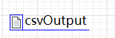
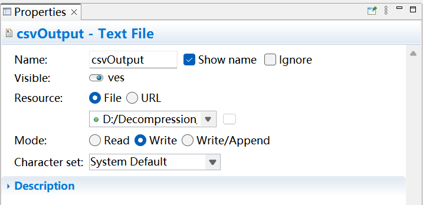
The text file that record 100,000 synthetic data and input these data in the form of a csv file.
该文本文件记录了 10 万条合成数据，并以 csv 格式将这些数据输入进来。

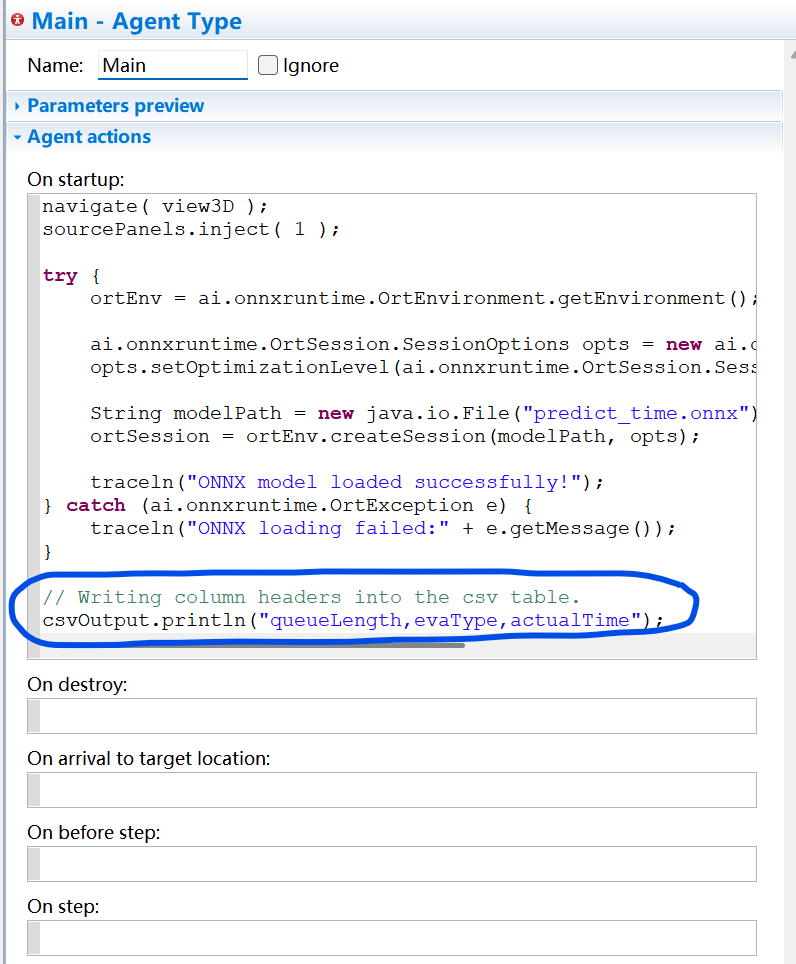
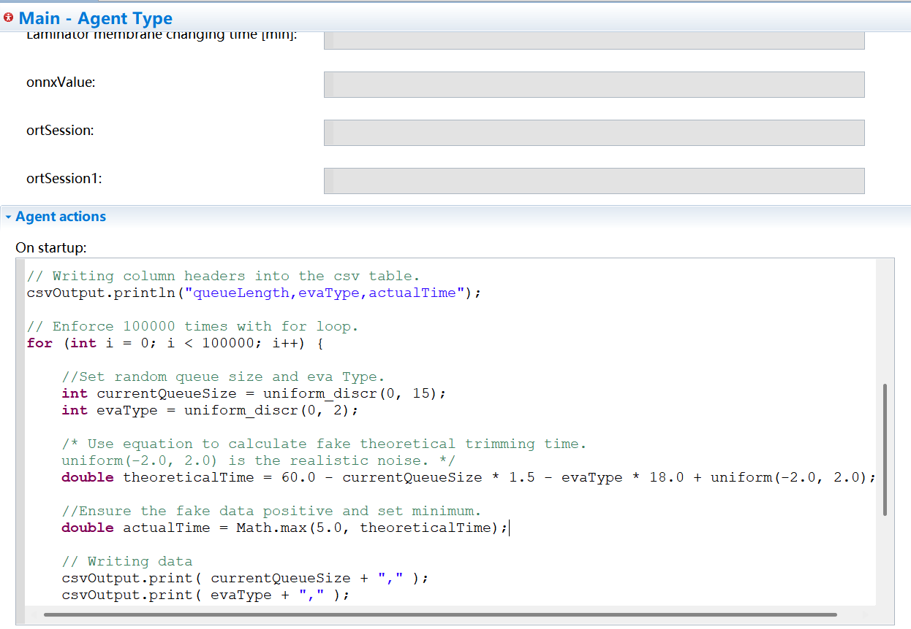
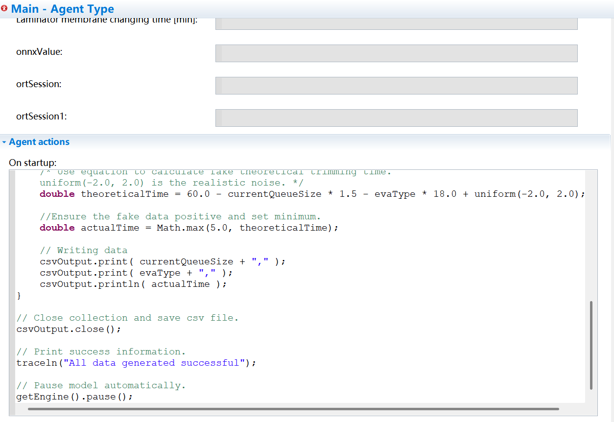
Codes to record 100,000 fake data.
用于记录 10 万组假数据的代码。

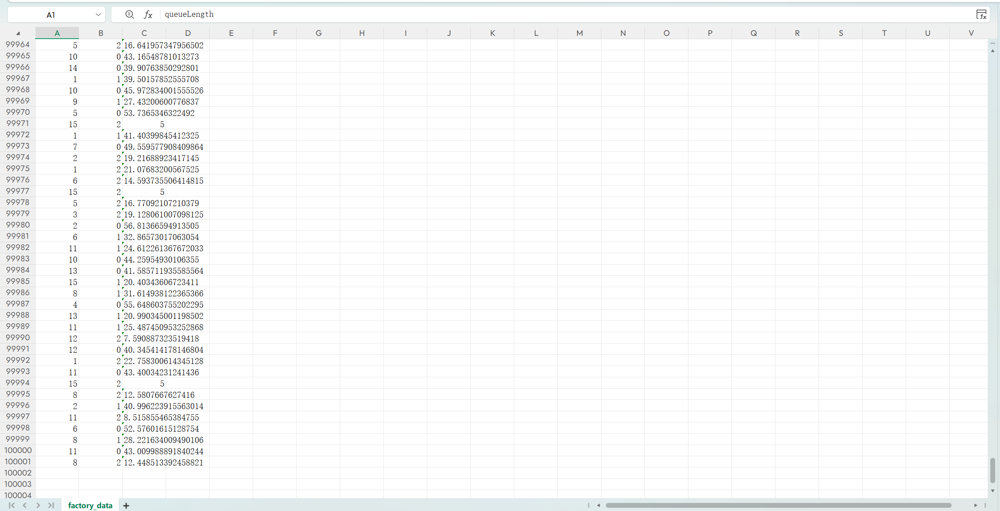
A part of fake data.
一部分假数据。

### 3.1 Model training 训练模型

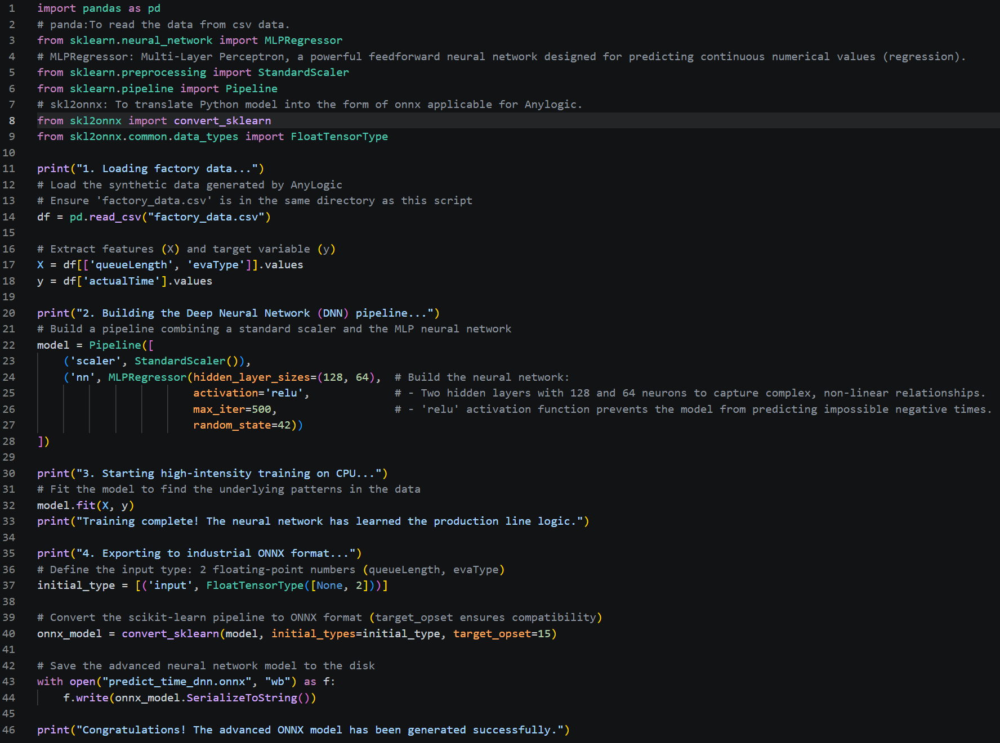
The Python file used for training the deep neural network model.
用来训练深度神经网络模型的Python文件。

### 3.1 Model embedding 嵌入模型
The result of DNN model training is **"predict_time_dnn.onnx"** replacing old linear regression model "predict_time.onnx“。
DNN 模型训练的结果是生成了“predict_time_dnn.onnx”文件，代替之前的线性回归模型“predict_time.onnx”。

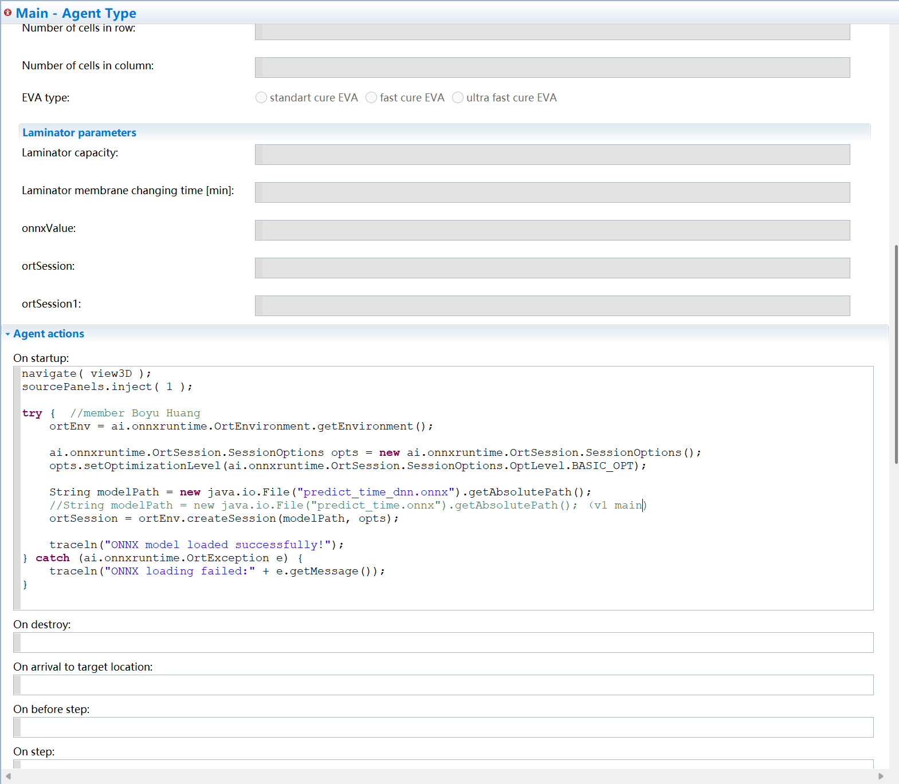
Code for loading the new ONNX model in agent Main
Main智能体中用以加载新ONNX模型的代码

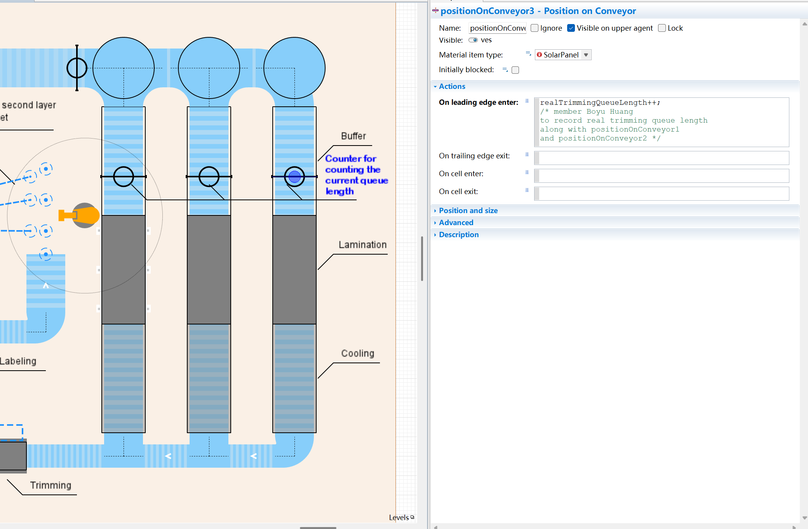
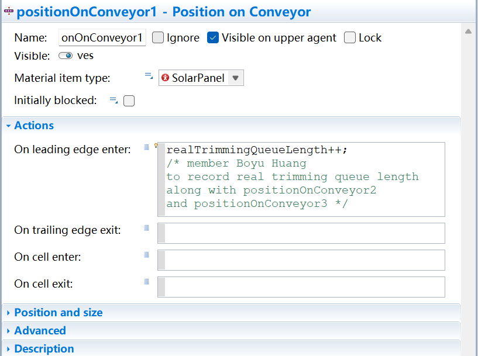
3 positions on conveyor to calculate current queue length (serving as 3 counters). When an solar panel pass one of these positions, the queue length adds 1. the queue length will minus 1 just after an solar panel enters trimming station.
在传送带上设置 3 个位置来计算当前的排队长度（作为 3 个计数器）。当一块太阳能板经过这些位置中的任何一个时，排队长度就会增加 1。在一块太阳能板进入修剪站后，排队长度会减去 1。

## 4. Initial Test 最初测试
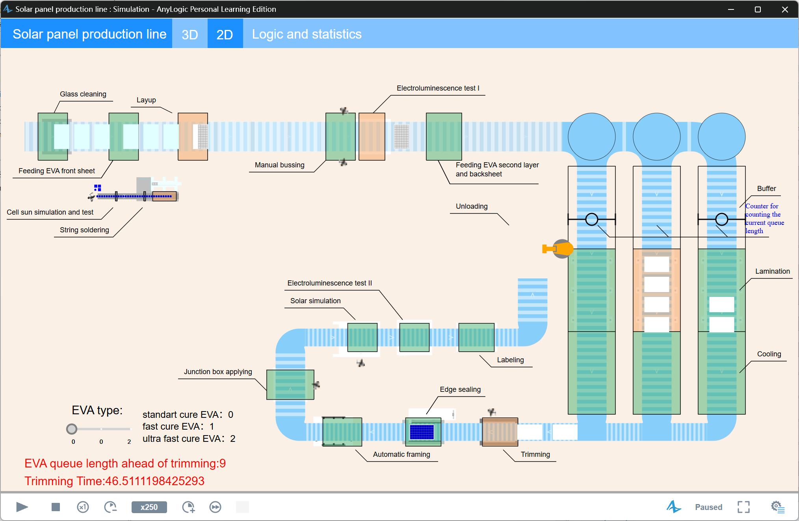
The running interface of alp file after embedding new DNN model.
嵌入新深度神经网络模型后的 alp 文件的运行界面。

To verify the simulation results, I record 2 csv file for reference when initial test:
为了验证模拟结果，我在初始测试时记录了两个 csv 文件作为参考：
**20260511_dnn_v1_inference_log.csv**: Logging the running data of the new DNN model. 记录了新的DNN模型的运行数据。
**20260511_sim_test_dnn_vs_linear.csv**: While logging the runtime data of the new DNN model, the output of the previous linear regression model was also recorded simultaneously as a comparative baseline. 在记录新的DNN模型的运行数据也记录了前面线性回归模型的运行数据作为对照。

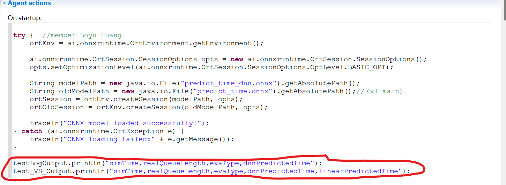
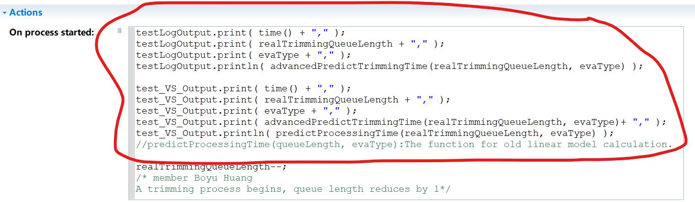
The relevant code used to record the running results of the DNN and the previous linear regression model.
用来记录DNN及先前线性回归模型的运行结果的相关代码。

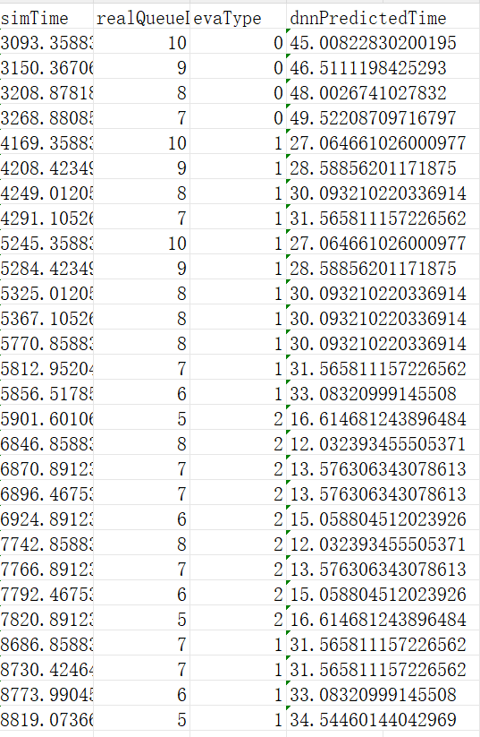
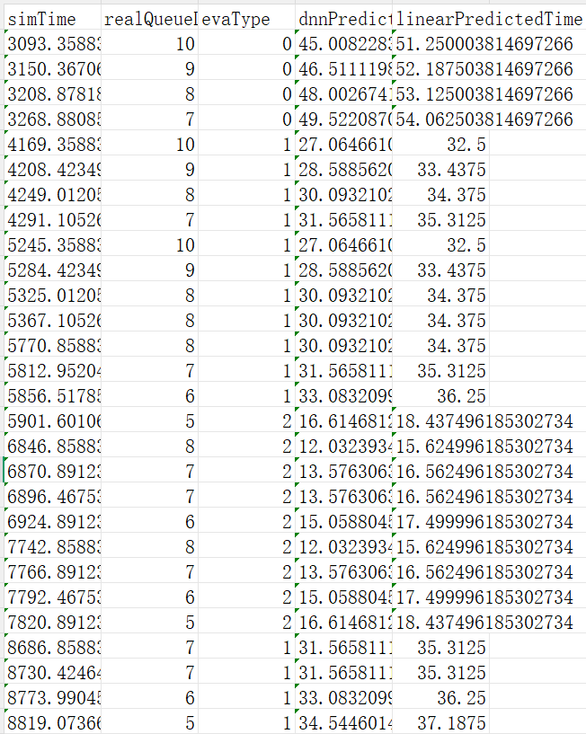
The logging result of running.
运行的记录结果。

## 5. Conclusion 总结
In summary, this branch completes the architectural upgrade of the Trimming station from a rigid linear formula to a dynamic Deep Learning model. It not only resolves the critical bug of negative processing time but also establishes a robust data logging mechanism (Shadow Testing), laying a solid foundation for the future intelligentization of the entire production line.
综上所述，本分支完成了修边工位从死板的线性公式向动态深度学习模型的底层架构升级。不仅解决了产生负数加工时间的致命 Bug，还建立了一套严健的数据记录机制（影子测试），为后续整条产线的全面智能化打下了坚实基础。

(Personal Note: Since I was rushing to push this update tonight to meet our project schedule, this documentation might be a bit brief and rough around the edges. Please bear with me! If anyone has questions while reviewing the code, I will definitely supplement this document later.)

另外跟各位组员说声抱歉：
因为今晚为了赶上咱们的项目进度（写完代码一看都已经十点多了😅），这份说明文档写得相对有些简陋和仓促，没能把每一行代码的细节都展开细讲。大家先将就看一下核心逻辑，请多包涵！后续如果大家在 Review 代码时有任何看不懂的地方，或者为了咱们的期末答辩觉得有必要，我随时再把文档补充完整。

**The code and test logs have all been pushed. Please review at your earliest convenience. 🚀**
**代码和最新的 CSV 测试日志都已经全部推送到远程仓库了，麻烦各位组员有空时查收并 Review 一下。辛苦大家！🚀**